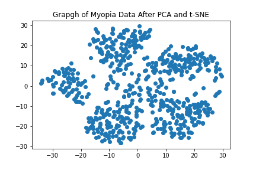
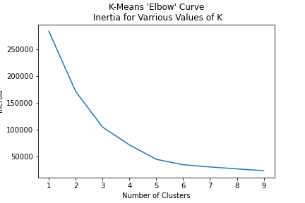
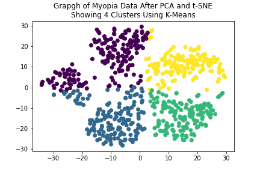

# Overview
This notebook uses pandas and sklearn libraries to looks at myopia patient data and classify patients into clusters/categories based on their data. The clusters could then be further analyzed to predict myopia based on the measures in the data. To prepare the data for cluster analysis, it is first scaled using a standard scaler. After scaling, the data is reduced to principal components retaining approximately 90% of the variance in the original data. Then to better visualize the data, t-SNE is performed to reduce the data to 2 dimensions so it can easily be plotted. Finally K-Means is performed for various cluster values and the optimal candidate for the number of clusters is chosen by analyzing an elbow curve.
# Contents
- myopia-unsupervised-learning.ipynb: Main notebook with myopia data cluster analysis
- Resources
    - myopia.csv: data in raw from [ClinicalTrials.gov](https://clinicaltrials.gov/ct2/show/NCT00000169)
# Results
After completing PCA and t-SNE on the data, it can be plotted in 2 dimension:
 

 
It appears that there are approximately 3-4 clusters in the data. K-means can be used to group the data into k clusters. A 'natural' value for the number of clusters can be found by plotting the [inertia](https://www.codecademy.com/learn/machine-learning/modules/dspath-clustering/cheatsheet) of each k-means. The plot of inertia for $0<k<10$ is shown below:
 

 
The 'Elbow' curve shows a significant drop in inertia for positive $k<4$ and for values of $k\geq5$, the drop in inertia is relatively constant and low. Therefore it appears $k=4$ would be a good number of clusters. Using the clusters for $k=4$, the following 2-d representation of the data is produced:
 

 
The resulting clusters are fairly consistent with what a human would identify as natural clusters in the 2-d re[representation of the data. The K-Means analysis shows the data can be clustered.